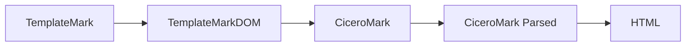

## Overview

The Template Playground uses a multi-stage transformation pipeline to convert TemplateMark templates into final HTML output. Understanding this pipeline helps you debug issues and create more sophisticated templates.

## Transformation Pipeline

The transformation process involves several stages:



### Stage 1: TemplateMark to TemplateMarkDOM

The `TemplateMarkTransformer` parses your template markdown and converts it into a document object model (DOM).

**Source Code Reference:** `src/store/store.ts:85-92`

```typescript
const templateMarkTransformer = new TemplateMarkTransformer();
const templateMarkDom = templateMarkTransformer.fromMarkdownTemplate(
  { content: template },
  modelManager,
  "contract",
  { verbose: false }
);
```

**What happens:**
- Parses markdown syntax
- Identifies TemplateMark blocks (`{{}}`, `{{#block}}`, formulas)
- Validates template syntax against the Concerto model
- Creates an intermediate DOM representation

### Stage 2: TemplateMarkDOM to CiceroMark

The `TemplateMarkInterpreter` generates CiceroMark by binding data to the template.

**Source Code Reference:** `src/store/store.ts:96`

```typescript
const engine = new TemplateMarkInterpreter(modelManager, {});
const ciceroMark = await engine.generate(templateMarkDom, data);
```

**What happens:**
- Binds JSON data to template variables
- Evaluates formulas and conditional logic
- Processes blocks (loops, conditionals, joins)
- Produces CiceroMark with resolved values

### Stage 3: CiceroMark to HTML

The `transform` function converts CiceroMark to the final HTML output.

**Source Code Reference:** `src/store/store.ts:100-107`

```typescript
const ciceroMarkJson = ciceroMark.toJSON();
const result = await transform(
  ciceroMarkJson,
  "ciceromark_parsed",
  ["html"],
  {},
  { verbose: false }
);
```

**What happens:**
- Parses CiceroMark JSON structure
- Applies markdown formatting rules
- Converts to HTML elements
- Returns final HTML string

## Core Components

### TemplateMarkTransformer

From `@accordproject/markdown-template` package.

**Purpose:** Converts markdown text with TemplateMark syntax into a structured DOM.

**Key Methods:**
- `fromMarkdownTemplate(content, modelManager, type, options)`: Parse template

**Configuration Options:**
```typescript
{
  verbose: false  // Enable detailed logging
}
```

### TemplateMarkInterpreter

From `@accordproject/template-engine` package.

**Purpose:** Executes template logic and binds data to produce CiceroMark.

**Key Methods:**
- `generate(templateMarkDom, data)`: Generate output from template and data

**Requirements:**
- Requires a `ModelManager` instance
- Data must conform to the Concerto model
- Template must reference a valid model type

### Transform Function

From `@accordproject/markdown-transform` package.

**Purpose:** Converts between markdown formats (CiceroMark, CommonMark, HTML, etc.).

**Signature:**
```typescript
transform(
  input: unknown,           // Input content
  from: string,            // Source format
  to: string[],            // Target format(s)
  options: object,         // Transform options
  processingOptions: {     // Processing options
    verbose?: boolean
  }
)
```

**Supported Formats:**
- `ciceromark`: CiceroMark JSON
- `ciceromark_parsed`: Parsed CiceroMark
- `markdown`: CommonMark
- `html`: HTML output
- `pdf`: PDF output (requires additional setup)

## Rebuild Logic

The playground implements a debounced rebuild function to handle real-time editing.

**Source Code Reference:** `src/store/store.ts:77-108`

```typescript
const rebuildDeBounce = debounce(rebuild, 500);

async function rebuild(
  template: string, 
  model: string, 
  dataString: string
): Promise<string> {
  const modelManager = new ModelManager({ strict: true });
  modelManager.addCTOModel(model, undefined, true);
  await modelManager.updateExternalModels();
  
  const engine = new TemplateMarkInterpreter(modelManager, {});
  const templateMarkTransformer = new TemplateMarkTransformer();
  
  const templateMarkDom = templateMarkTransformer.fromMarkdownTemplate(
    { content: template },
    modelManager,
    "contract",
    { verbose: false }
  );
  
  const data = JSON.parse(dataString);
  const ciceroMark = await engine.generate(templateMarkDom, data);
  const ciceroMarkJson = ciceroMark.toJSON();
  
  const result = await transform(
    ciceroMarkJson,
    "ciceromark_parsed",
    ["html"],
    {},
    { verbose: false }
  );
  
  return result;
}
```

**Key Features:**
- **Debouncing:** 500ms delay prevents excessive rebuilds during typing
- **Strict mode:** Model validation is enabled
- **External models:** Automatically resolves and loads imported models
- **Error propagation:** Errors bubble up to the error handling system

## State Management

The rebuild process integrates with Zustand store for state management.

**Source Code Reference:** `src/store/store.ts:255-266`

```typescript
rebuild: async () => {
  const { templateMarkdown, modelCto, data } = get();
  try {
    const result = await rebuildDeBounce(
      templateMarkdown, 
      modelCto, 
      data
    );
    set(() => ({ 
      agreementHtml: result, 
      error: undefined 
    }));
  } catch (error: unknown) {
    set(() => ({
      error: formatError(error),
      isProblemPanelVisible: true,
    }));
  }
}
```

**State Updates:**
- `agreementHtml`: Stores successful transformation result
- `error`: Stores error message if transformation fails
- `isProblemPanelVisible`: Auto-opens problem panel on errors

## Performance Considerations

### Debouncing

The 500ms debounce prevents unnecessary rebuilds:

```typescript
const rebuildDeBounce = debounce(rebuild, 500);
```

**Benefits:**
- Reduces CPU usage during rapid typing
- Prevents UI jank from too-frequent updates
- Allows batching of multiple edits

### Async Processing

All transformation stages are asynchronous:

```typescript
await modelManager.updateExternalModels();
const ciceroMark = await engine.generate(templateMarkDom, data);
const result = await transform(...);
```

**Benefits:**
- Non-blocking UI updates
- Better handling of long-running operations
- Enables proper error handling

## Advanced Transformations

### Custom Transform Options

You can customize the transform behavior:

```typescript
await transform(
  ciceroMarkJson,
  "ciceromark_parsed",
  ["html"],
  {
    // Custom options
  },
  { 
    verbose: true  // Enable detailed logging
  }
);
```

### Multiple Output Formats

Generate multiple formats in a single transform:

```typescript
const [html, markdown] = await transform(
  ciceroMarkJson,
  "ciceromark_parsed",
  ["html", "markdown"],
  {},
  { verbose: false }
);
```

### Format Conversion

Convert between markdown formats:

```typescript
// CommonMark to CiceroMark
const ciceromark = await transform(
  markdownContent,
  "markdown",
  ["ciceromark"],
  {},
  {}
);
```

<Note>
The transformation pipeline is stateless. Each rebuild creates a fresh ModelManager and interpreter instance.
</Note>

## Debugging Transformations

Enable verbose logging to see detailed transformation steps:

```typescript
const templateMarkDom = templateMarkTransformer.fromMarkdownTemplate(
  { content: template },
  modelManager,
  "contract",
  { verbose: true }  // Enable logging
);
```

Check the browser console for:
- Parsing details
- Model validation messages
- Transformation steps
- Timing information

<Warning>
Verbose mode generates significant console output. Use it only for debugging specific issues.
</Warning>

## Common Transformation Issues

### Model Not Found

**Symptom:** Error about missing or invalid model type

**Solution:** Ensure the third parameter matches your model namespace:

```typescript
fromMarkdownTemplate(
  { content: template },
  modelManager,
  "contract",  // Must match model type
  { verbose: false }
)
```

### Data Binding Failures

**Symptom:** Variables not rendering or type errors

**Solution:** Validate your data structure matches the Concerto model exactly

### Malformed CiceroMark

**Symptom:** Transform fails with parsing errors

**Solution:** Inspect `ciceroMarkJson` structure before passing to `transform()`

## Next Steps

- Learn about [Error Handling](/advanced/error-handling) in the transformation pipeline
- Review [Template Engine API](/reference/api/template-engine) for detailed API docs
- Explore [Custom Logic](/advanced/custom-logic) to understand what happens during data binding