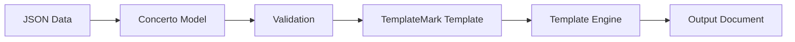

Data binding is the process that connects your JSON data to your Concerto model and TemplateMark template. Understanding how binding works is essential for creating effective templates.

## The binding pipeline

Data flows through the template system in this sequence:



1. **JSON Data** - Your input data in JSON format
2. **Concerto Model** - Validates the structure and types
3. **Validation** - Ensures data matches the model
4. **TemplateMark Template** - References data properties
5. **Template Engine** - Merges data with template
6. **Output Document** - Generated result (HTML, PDF, etc.)

## Basic binding

The simplest form of binding maps JSON properties directly to template variables.

### Model

```concerto
namespace hello@1.0.0

@template
concept HelloWorld {
    o String name
}
```

### Data

```json
{
    "$class": "hello@1.0.0.HelloWorld",
    "name": "John Doe"
}
```

### Template

```markdown
### Hello {{name}}!
```

### Result

```
Hello John Doe!
```

<Note>
The `$class` property in your JSON data must exactly match the namespace and concept name from your Concerto model.
</Note>

## Nested object binding

When your model has nested concepts, you use the `{{#clause}}` block to bind to them.

### Model

```concerto
namespace hello@1.0.0

concept Address {
    o String line1
    o String city
    o String state
    o String country
}

@template
concept Customer {
    o Address address
}
```

### Data

```json
{
    "$class": "hello@1.0.0.Customer",
    "address": {
        "$class": "hello@1.0.0.Address",
        "line1": "1 Main Street",
        "city": "Boston",
        "state": "MA",
        "country": "USA"
    }
}
```

### Template

```markdown
{{#clause address}}  
#### Address
{{line1}},  
{{city}}, {{state}},  
{{country}}  
{{/clause}}
```

<Tip>
Inside a `{{#clause}}` block, you can directly reference properties of the nested object without prefixing them with the parent name.
</Tip>

## Array binding

Arrays can be bound using list blocks or join operations.

### Simple string arrays

**Model:**
```concerto
namespace test@1.0.0

@template
concept Person {
    o String[] middleNames
}
```

**Data:**
```json
{
    "$class": "test@1.0.0.Person",
    "middleNames": ["Tenzin", "Isaac", "Mia"]
}
```

**Template:**
```markdown
Ordered:
{{#olist middleNames}}
- {{this}}
{{/olist}}

Unordered:
{{#ulist middleNames}}
- {{this}}
{{/ulist}}
```

### Arrays of objects

**Model:**
```concerto
concept OrderLine {
    o String sku
    o Integer quantity
    o Double price
}

concept Order {
    o OrderLine[] orderLines
}
```

**Data:**
```json
{
    "orderLines": [
        {
            "$class": "hello@1.0.0.OrderLine",
            "sku": "ABC-123",
            "quantity": 3,
            "price": 29.99
        },
        {
            "$class": "hello@1.0.0.OrderLine",
            "sku": "DEF-456",
            "quantity": 5,
            "price": 19.99
        }
    ]
}
```

**Template:**
```markdown
{{#ulist orderLines}}
- {{quantity}}x _{{sku}}_ @ £{{price as "0,0.00"}}
{{/ulist}}
```

Each iteration of the list has access to the properties of the current `OrderLine` object.

## Optional field binding

Optional fields require special handling to avoid errors when the field is missing.

### Model

```concerto
namespace org.accordproject.employment@1.0.0

concept Probation {
  o Integer months
}

@template
concept EmploymentOffer {
  o String candidateName
  o Probation probation optional
}
```

### Template with conditional

```markdown
{{#if probation}}
{{#clause probation}}
This offer includes a probation period of **{{months}} months**.
{{/clause}}
{{/if}}
```

The `{{#if}}` block checks if `probation` exists before trying to access its properties.

### Using optional block

```markdown
{{#optional loyaltyStatus}}
You have loyalty status: {{level}}.
{{else}}
You do not have a loyalty status.
{{/optional}}
```

<Warning>
Always check for the existence of optional fields before accessing their nested properties to avoid runtime errors.
</Warning>

## Type-based formatting

Different data types support different formatting options.

### DateTime formatting

```markdown
DATE: {{startDate as "DD MMMM YYYY"}}
Time: {{startDate as "HH:mm:ss"}}
Short: {{startDate as "D MMMM YYYY"}}
```

### Number formatting

```markdown
With thousands separator: {{doubleValue as "0,0"}}
With decimals: {{price as "0,0.00"}}
With currency: {{salary as "0,0.00 CCC"}}
```

### Enum values

Enums bind as strings:

```markdown
{{#join items locale="en" style="long"}}{{/join}}
```

For enum array `["CAR", "ACCESSORIES", "SPARE_PARTS"]`, this produces: "CAR, ACCESSORIES, and SPARE_PARTS"

## Complex binding example

Let's look at a complete employment offer that demonstrates multiple binding techniques.

### Model

```concerto
namespace org.accordproject.employment@1.0.0

concept MonetaryAmount {
  o Double doubleValue
  o String currencyCode
}

concept Probation {
  o Integer months
}

@template
concept EmploymentOffer {
  o String candidateName
  o String companyName
  o String roleTitle
  o MonetaryAmount annualSalary
  o DateTime startDate
  o Probation probation optional
}
```

### Data

```json
{
  "$class": "org.accordproject.employment@1.0.0.EmploymentOffer",
  "candidateName": "Ishan Gupta",
  "companyName": "Tech Innovators Inc.",
  "roleTitle": "Junior AI Engineer",
  "annualSalary": {
    "$class": "org.accordproject.employment@1.0.0.MonetaryAmount",
    "doubleValue": 85000,
    "currencyCode": "USD"
  },
  "startDate": "2025-02-01T09:00:00.000Z",
  "probation": {
    "$class": "org.accordproject.employment@1.0.0.Probation",
    "months": 3
  }
}
```

### Template

```markdown
DATE: {{startDate as "DD MMMM YYYY"}}

Dear {{candidateName}},

We are pleased to offer you the position of **{{roleTitle}}** at **{{companyName}}**.

{{#clause annualSalary}}
Your annual gross salary will be **{{doubleValue as "0,0"}} {{currencyCode}}**.
{{/clause}}

{{#if probation}}
{{#clause probation}}
This offer includes a probation period of **{{months}} months**.
{{/clause}}
{{/if}}

Sincerely,  
**Human Resources**  
{{companyName}}
```

This template demonstrates:
- Simple property binding: `{{candidateName}}`, `{{roleTitle}}`
- Date formatting: `{{startDate as "DD MMMM YYYY"}}`
- Nested object binding: `{{#clause annualSalary}}`
- Number formatting: `{{doubleValue as "0,0"}}`
- Optional field handling: `{{#if probation}}`

## Binding in formulas

You can access data properties in TypeScript formulas using standard JavaScript:

```markdown
Your name has {} characters.

Order placed {} days ago.

Total: {}
```

Formulas have access to:
- All properties in the current scope
- The `now` object for date operations (using moment.js)
- Standard JavaScript methods and operations

## Validation and error handling

The binding process includes strict validation. From `store.ts:79-108`, the rebuild function:

```typescript
async function rebuild(template: string, model: string, dataString: string): Promise<string> {
  const modelManager = new ModelManager({ strict: true });
  modelManager.addCTOModel(model, undefined, true);
  await modelManager.updateExternalModels();
  
  const engine = new TemplateMarkInterpreter(modelManager, {});
  const templateMarkTransformer = new TemplateMarkTransformer();
  const templateMarkDom = templateMarkTransformer.fromMarkdownTemplate(
    { content: template },
    modelManager,
    "contract",
    { verbose: false }
  );
  
  const data = JSON.parse(dataString);
  const ciceroMark = await engine.generate(templateMarkDom, data);
  // ...
}
```

Errors occur when:
- Data doesn't match the model structure
- Required fields are missing
- Field types don't match (string vs number, etc.)
- `$class` property is incorrect or missing
- Referenced properties don't exist in the model

<Note>
The playground displays binding errors in the Problems panel, helping you identify and fix issues quickly.
</Note>

## Scope rules

Understanding scope is crucial for correct binding:

### Root scope

At the root level, you have access to all properties of the `@template` concept:

```markdown
{{candidateName}} - Available at root
{{companyName}} - Available at root
```

### Clause scope

Inside a `{{#clause}}` block, scope changes to that object:

```markdown
{{#clause annualSalary}}
  {{doubleValue}} - Available inside clause
  {{currencyCode}} - Available inside clause
  {{candidateName}} - NOT available (wrong scope)
{{/clause}}
```

### List scope

Inside list blocks, scope is the current item:

```markdown
{{#ulist orderLines}}
  {{sku}} - Current item's sku
  {{quantity}} - Current item's quantity
  {{this}} - Reference to entire current item
{{/ulist}}
```

## Common binding patterns

<AccordionGroup>
  <Accordion title="Conditional sections">
    ```markdown
    {{#if probation}}
    Content only shown when probation exists.
    {{/if}}
    ```
  </Accordion>
  
  <Accordion title="Nested data access">
    ```markdown
    {{#clause address}}
    {{line1}}, {{city}}
    {{/clause}}
    ```
  </Accordion>
  
  <Accordion title="Array iteration">
    ```markdown
    {{#ulist items}}
    - {{this}}
    {{/ulist}}
    ```
  </Accordion>
  
  <Accordion title="Formatted output">
    ```markdown
    {{date as "DD MMMM YYYY"}}
    {{amount as "0,0.00"}}
    ```
  </Accordion>
</AccordionGroup>

## Debugging binding issues

When data binding fails:

1. **Check the `$class` property** - It must exactly match your namespace and concept name
2. **Verify required fields** - Ensure all non-optional fields are present in your data
3. **Match property names** - Property names are case-sensitive
4. **Validate nested objects** - Each nested object needs its own `$class` property
5. **Check scope** - Ensure you're referencing properties in the correct scope
6. **Review the Problems panel** - The playground shows detailed error messages

## Next steps

<CardGroup cols={2}>
  <Card title="Template engine" icon="gear" href="/concepts/template-engine">
    Learn how the engine processes bindings
  </Card>
  <Card title="TemplateMark" icon="file-code" href="/concepts/templatemark">
    Review TemplateMark syntax for binding
  </Card>
</CardGroup>