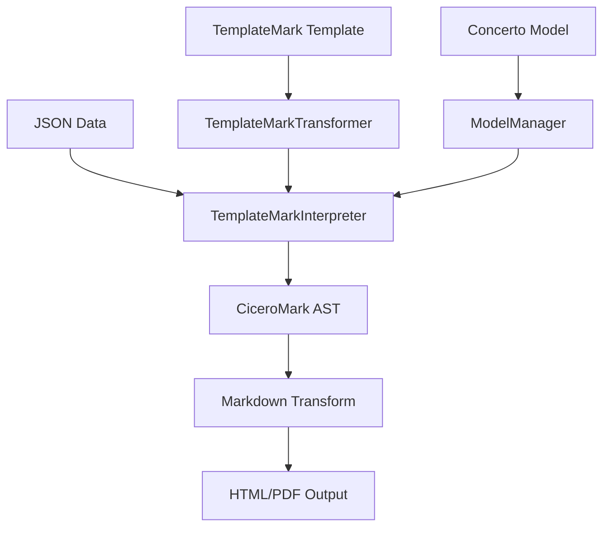

The Accord Project Template Engine is the core component that transforms TemplateMark templates and JSON data into formatted output documents. It orchestrates the entire template processing pipeline.

## Architecture overview

The Template Engine consists of several key components:



- **ModelManager** - Loads and validates Concerto models
- **TemplateMarkTransformer** - Parses TemplateMark into an AST
- **TemplateMarkInterpreter** - Merges data with the template AST
- **Markdown Transform** - Converts output to various formats

<Info>
The Template Engine is part of the broader Accord Project ecosystem, used for creating smart legal contracts and agreements.
</Info>

## Processing pipeline

The template processing happens in distinct phases:

### Phase 1: Model loading

The Concerto model is loaded and validated:

```typescript
const modelManager = new ModelManager({ strict: true });
modelManager.addCTOModel(model, undefined, true);
await modelManager.updateExternalModels();
```

From `store.ts:80-82`, this process:
1. Creates a ModelManager in strict mode for rigorous validation
2. Adds the CTO model definition
3. Fetches any external models referenced via imports

<Note>
Strict mode ensures complete type checking and validation. Any model errors are caught at this stage.
</Note>

### Phase 2: Template parsing

The TemplateMark template is parsed into a DOM structure:

```typescript
const engine = new TemplateMarkInterpreter(modelManager, {});
const templateMarkTransformer = new TemplateMarkTransformer();
const templateMarkDom = templateMarkTransformer.fromMarkdownTemplate(
  { content: template },
  modelManager,
  "contract",
  { verbose: false }
);
```

From `store.ts:83-92`, this:
1. Creates a TemplateMarkTransformer instance
2. Parses the markdown template into a TemplateMark DOM
3. Validates template variables against the model
4. Creates an intermediate representation for processing

The parser identifies:
- Variable placeholders `{{name}}`
- Conditional blocks `{{#if condition}}`
- Loop blocks `{{#ulist items}}`
- Clause blocks `{{#clause object}}`
- Formulas `{}`

### Phase 3: Data merging

The JSON data is merged with the template:

```typescript
const data = JSON.parse(dataString);
const ciceroMark = await engine.generate(templateMarkDom, data);
```

From `store.ts:94-96`, the engine:
1. Parses the JSON data
2. Validates data against the Concerto model
3. Traverses the template DOM
4. Replaces variables with actual values
5. Evaluates conditionals and loops
6. Executes formulas
7. Produces a CiceroMark AST

<Tip>
CiceroMark is an intermediate format that represents the merged document before final output transformation.
</Tip>

### Phase 4: Output transformation

The CiceroMark is transformed to the desired output format:

```typescript
const ciceroMarkJson = ciceroMark.toJSON();
const result = await transform(
  ciceroMarkJson,
  "ciceromark_parsed",
  ["html"],
  {},
  { verbose: false }
);
```

From `store.ts:98-107`, this:
1. Converts CiceroMark to JSON
2. Applies the markdown-transform library
3. Generates the final HTML output

Supported output formats include:
- HTML
- PDF
- DOCX
- Plain text
- Markdown

## Error handling

The Template Engine provides comprehensive error handling throughout the pipeline:

```typescript
try {
  const result = await rebuildDeBounce(templateMarkdown, modelCto, data);
  set(() => ({ agreementHtml: result, error: undefined }));
} catch (error: unknown) {
  set(() => ({
    error: formatError(error),
    isProblemPanelVisible: true,
  }));
}
```

From `store.ts:257-265`, errors are caught and formatted for display.

### Error types

<AccordionGroup>
  <Accordion title="Model validation errors">
    Occur when the Concerto model has syntax errors or invalid type definitions.
    
    ```
    Error: Model file has syntax errors
    ```
  </Accordion>
  
  <Accordion title="Template parsing errors">
    Happen when TemplateMark syntax is incorrect or references undefined variables.
    
    ```
    Error: Variable 'unknownField' not found in model
    ```
  </Accordion>
  
  <Accordion title="Data validation errors">
    Triggered when JSON data doesn't match the model structure.
    
    ```
    Error: Required property 'candidateName' is missing
    ```
  </Accordion>
  
  <Accordion title="Formula execution errors">
    Occur when TypeScript formulas throw exceptions.
    
    ```
    Error: Cannot read property 'length' of undefined
    ```
  </Accordion>
</AccordionGroup>

## Performance optimizations

The Template Playground implements several optimizations:

### Debounced rebuilds

```typescript
const rebuildDeBounce = debounce(rebuild, 500);
```

From `store.ts:77`, the rebuild function is debounced by 500ms. This prevents excessive reprocessing when you're typing in the editor.

### State management

The playground uses Zustand with Immer for efficient state updates:

```typescript
const useAppStore = create<AppState>()(immer(devtools((set, get) => {
  // ...
})));
```

From `store.ts:163-402`, this provides:
- Immutable state updates
- DevTools integration for debugging
- Selective re-rendering

### Caching

The ModelManager caches external models to avoid redundant network requests:

```typescript
await modelManager.updateExternalModels();
```

## Template Engine API

The core engine exposes several methods:

### TemplateMarkInterpreter

```typescript
const engine = new TemplateMarkInterpreter(modelManager, options);
```

**Constructor parameters:**
- `modelManager` - ModelManager instance with loaded models
- `options` - Configuration object (typically empty `{}`)

**Key method:**
```typescript
await engine.generate(templateMarkDom, data)
```

Generates a CiceroMark document by merging the template with data.

### TemplateMarkTransformer

```typescript
const transformer = new TemplateMarkTransformer();
```

**Key method:**
```typescript
transformer.fromMarkdownTemplate(template, modelManager, kind, options)
```

**Parameters:**
- `template` - Object with `content` property containing the template string
- `modelManager` - ModelManager instance
- `kind` - Template kind (typically `"contract"`)
- `options` - Configuration object with `verbose` flag

### Markdown Transform

```typescript
await transform(ciceroMarkJson, "ciceromark_parsed", ["html"], {}, options)
```

**Parameters:**
- `ciceroMarkJson` - CiceroMark document as JSON
- `"ciceromark_parsed"` - Source format identifier
- `["html"]` - Array of target formats
- `{}` - Transform options
- `options` - Additional options like `verbose`

## Real-world usage example

Here's a complete example of using the Template Engine:

```typescript
import { ModelManager } from "@accordproject/concerto-core";
import { TemplateMarkInterpreter } from "@accordproject/template-engine";
import { TemplateMarkTransformer } from "@accordproject/markdown-template";
import { transform } from "@accordproject/markdown-transform";

async function processTemplate(template, model, data) {
  // Step 1: Load the model
  const modelManager = new ModelManager({ strict: true });
  modelManager.addCTOModel(model, undefined, true);
  await modelManager.updateExternalModels();
  
  // Step 2: Parse the template
  const engine = new TemplateMarkInterpreter(modelManager, {});
  const templateMarkTransformer = new TemplateMarkTransformer();
  const templateMarkDom = templateMarkTransformer.fromMarkdownTemplate(
    { content: template },
    modelManager,
    "contract",
    { verbose: false }
  );
  
  // Step 3: Merge with data
  const ciceroMark = await engine.generate(templateMarkDom, data);
  
  // Step 4: Transform to HTML
  const result = await transform(
    ciceroMark.toJSON(),
    "ciceromark_parsed",
    ["html"],
    {},
    { verbose: false }
  );
  
  return result;
}

// Usage
const html = await processTemplate(
  "Hello {{name}}!",
  "namespace hello@1.0.0\n@template\nconcept HelloWorld { o String name }",
  { "$class": "hello@1.0.0.HelloWorld", "name": "World" }
);
```

## Advanced features

### Custom formatting functions

The engine supports custom formatters for dates and numbers:

```markdown
{{date as "DD MMMM YYYY"}}
{{amount as "0,0.00 CCC"}}
```

Formatters use:
- **Dates**: Moment.js format strings
- **Numbers**: Numeral.js format strings

### Formula context

Formulas execute with access to:

```javascript
// Current data in scope
name.length

// Moment.js 'now' object
now.diff(order.createdAt, 'day')

// Array methods
order.orderLines.map(ol => ol.price * ol.quantity)
```

### Locale support

The join block supports internationalization:

```markdown
{{#join items locale="en" style="long"}}{{/join}}
{{#join items locale="fr" type="disjunction"}}{{/join}}
```

Supported locales include: `en`, `en-GB`, `fr`, and others.

## Integration with the playground

The playground wraps the Template Engine with additional functionality:

### Automatic rebuilds

Whenever you edit the template, model, or data:

```typescript
setTemplateMarkdown: async (template: string) => {
  set(() => ({ templateMarkdown: template }));
  const { modelCto, data } = get();
  try {
    const result = await rebuildDeBounce(template, modelCto, data);
    set(() => ({ agreementHtml: result, error: undefined }));
  } catch (error: unknown) {
    set(() => ({
      error: formatError(error),
      isProblemPanelVisible: true,
    }));
  }
}
```

From `store.ts:267-279`, the engine automatically reprocesses the template.

### Error display

Errors are formatted and shown in the Problems panel:

```typescript
function formatError(error: unknown): string {
  if (typeof error === "string") return error;
  if (Array.isArray(error)) return error.map((e) => formatError(e)).join("\n");
  if (error && typeof error === "object" && "code" in error) {
    const errorObj = error as { code?: unknown; errors?: unknown; renderedMessage?: unknown };
    const sub = errorObj.errors ? formatError(errorObj.errors) : "";
    const msg = String(errorObj.renderedMessage ?? "");
    return `Error: ${String(errorObj.code ?? "")} ${sub} ${msg}`;
  }
  return String(error);
}
```

From `store.ts:407-418`, complex error objects are flattened into readable messages.

<Warning>
The Template Engine runs synchronously after initial setup. Long-running formulas or large datasets can impact performance.
</Warning>

## Best practices

1. **Model validation first** - Ensure your Concerto model is valid before testing templates
2. **Use strict mode** - Always initialize ModelManager with `{ strict: true }`
3. **Handle errors gracefully** - Wrap engine calls in try-catch blocks
4. **Debounce updates** - Don't trigger rebuilds on every keystroke
5. **Cache models** - Reuse ModelManager instances when processing multiple templates
6. **Minimize formula complexity** - Keep formulas simple and fast
7. **Test with real data** - Use production-like data for testing

## Debugging tips

<Steps>
  <Step title="Enable verbose mode">
    Set `verbose: true` in options to see detailed logging:
    ```typescript
    { verbose: true }
    ```
  </Step>
  
  <Step title="Inspect intermediate AST">
    Log the TemplateMark DOM to understand parsing:
    ```typescript
    console.log(JSON.stringify(templateMarkDom, null, 2));
    ```
  </Step>
  
  <Step title="Validate data separately">
    Use ModelManager to validate data before processing:
    ```typescript
    const serializer = modelManager.getSerializer();
    serializer.fromJSON(data);
    ```
  </Step>
  
  <Step title="Test formulas in isolation">
    Extract complex formulas and test them with sample data before embedding in templates.
  </Step>
</Steps>

## Next steps

<CardGroup cols={2}>
  <Card title="TemplateMark" icon="file-code" href="/concepts/templatemark">
    Learn the template syntax the engine processes
  </Card>
  <Card title="Concerto models" icon="code" href="/concepts/concerto-models">
    Understand the models the engine validates against
  </Card>
</CardGroup>