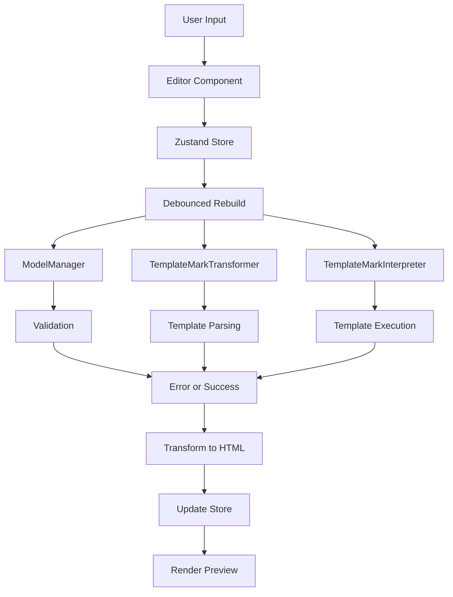

## Project Overview

The Template Playground is a React-based web application built with Vite and TypeScript. It provides an interactive environment for working with Accord Project templates, combining TemplateMark, Concerto models, and data to generate agreements.

## Technology Stack

### Core Technologies

- **React 18**: UI framework with hooks and functional components
- **TypeScript**: Type-safe JavaScript with strict mode enabled
- **Vite**: Fast build tool and development server
- **Zustand**: Lightweight state management with middleware support

### Accord Project Libraries

- **@accordproject/concerto-core**: Data modeling and validation
- **@accordproject/template-engine**: TemplateMark interpretation and execution
- **@accordproject/markdown-template**: TemplateMark parsing and transformation
- **@accordproject/markdown-transform**: Converting between markdown formats (HTML, PDF)

### UI & Styling

- **Ant Design**: Component library for UI elements
- **Monaco Editor**: Code editor for template, model, and data editing
- **Styled Components**: CSS-in-JS styling
- **Tailwind CSS**: Utility-first CSS framework

## Directory Structure

```
src/
├── ai-assistant/          # AI integration for template assistance
│   ├── activityTracker.ts # Track user activity
│   ├── autocompletion.ts  # AI-powered autocomplete
│   ├── chatRelay.ts       # Chat communication handler
│   ├── llmProviders.ts    # LLM provider integrations
│   └── prompts.ts         # AI prompt templates
├── components/            # React components
│   ├── AIChatPanel.tsx    # AI assistant chat interface
│   ├── Content.tsx        # Main content area
│   ├── Navbar.tsx         # Top navigation
│   ├── PlaygroundSidebar.tsx  # Sidebar navigation
│   ├── ProblemPanel.tsx   # Error/problem display
│   └── ...
├── constants/             # Static configuration
│   └── learningSteps/     # Learning pathway steps
├── contexts/              # React contexts
│   └── MarkdownEditorContext.tsx
├── editors/               # Editor components
│   ├── ConcertoEditor.tsx # Model editor
│   ├── JSONEditor.tsx     # Data editor
│   ├── MarkdownEditor.tsx # Template editor
│   └── editorsContainer/  # Editor wrappers
├── pages/                 # Page components
│   ├── LearnNow.tsx       # Learning pathway page
│   └── MainContainer.tsx  # Main playground page
├── samples/               # Template samples
│   ├── helloworld.ts      # Hello World sample
│   ├── nda.ts             # NDA sample
│   └── ...
├── store/                 # State management
│   └── store.ts           # Zustand store
├── styles/                # Styled components
├── tests/                 # Test files
│   ├── components/        # Component tests
│   ├── store/             # Store tests
│   └── utils/             # Utility tests
├── types/                 # TypeScript types
├── utils/                 # Utility functions
│   ├── compression/       # URL compression for sharing
│   ├── helpers/           # Helper functions
│   └── testing/           # Test setup
├── App.tsx                # Main app component
└── main.tsx               # Application entry point
```

## Core Components

### State Management (store/store.ts)

The application uses Zustand for state management with:

- **Immer middleware**: Immutable state updates
- **DevTools middleware**: Redux DevTools integration
- **Persistence**: LocalStorage for theme, UI panels, and settings

#### Key State Properties

```typescript
- templateMarkdown: string    // Template content
- modelCto: string            // Concerto model
- data: string                // JSON data
- agreementHtml: string       // Generated output
- error: string | undefined   // Error messages
- samples: Array<Sample>      // Available samples
- chatState: ChatState        // AI chat state
- aiConfig: AIConfig | null   // AI configuration
```

#### Key Actions

- `setTemplateMarkdown()`: Update template and rebuild
- `setModelCto()`: Update model and rebuild
- `setData()`: Update data and rebuild
- `rebuild()`: Regenerate agreement from current state
- `loadSample()`: Load a predefined sample
- `generateShareableLink()`: Create compressed shareable URL
- `loadFromLink()`: Load state from compressed URL

### Template Processing Pipeline

The rebuild process in `store/store.ts` follows this flow:

<Steps>
  <Step title="Model Validation">
    ```typescript
    const modelManager = new ModelManager({ strict: true });
    modelManager.addCTOModel(model, undefined, true);
    await modelManager.updateExternalModels();
    ```
  </Step>

  <Step title="Template Parsing">
    ```typescript
    const templateMarkTransformer = new TemplateMarkTransformer();
    const templateMarkDom = templateMarkTransformer.fromMarkdownTemplate(
      { content: template },
      modelManager,
      "contract"
    );
    ```
  </Step>

  <Step title="Template Execution">
    ```typescript
    const engine = new TemplateMarkInterpreter(modelManager, {});
    const data = JSON.parse(dataString);
    const ciceroMark = await engine.generate(templateMarkDom, data);
    ```
  </Step>

  <Step title="Output Transformation">
    ```typescript
    const result = await transform(
      ciceroMark.toJSON(),
      "ciceromark_parsed",
      ["html"]
    );
    ```
  </Step>
</Steps>

### Editor Components

#### ConcertoEditor.tsx

Monaco editor configured for Concerto modeling language:
- Syntax highlighting for `.cto` files
- Real-time validation
- Debounced updates to store

#### MarkdownEditor.tsx

TemplateMark editor with:
- Custom toolbar for TemplateMark syntax
- Command palette integration
- Markdown preview

#### JSONEditor.tsx

JSON data editor with:
- Syntax validation
- Pretty printing
- Error highlighting

### AI Assistant (ai-assistant/)

The AI assistant provides intelligent template help:

- **llmProviders.ts**: Integrations for OpenAI, Anthropic, Google, Mistral
- **chatRelay.ts**: Message routing and streaming responses
- **autocompletion.ts**: Context-aware code suggestions
- **activityTracker.ts**: User interaction tracking for better AI context

### Sharing & Compression (utils/compression/)

The playground supports sharing templates via URL:

```typescript
// Compress state into URL-safe string
const compressed = compress({
  templateMarkdown,
  modelCto,
  data,
  agreementHtml
});

// Generate shareable link
const url = `${window.location.origin}/#data=${compressed}`;
```

Uses `lz-string` library for efficient compression.

## Configuration Files

### vite.config.ts

- Node.js polyfills for browser compatibility
- React plugin with Fast Refresh
- Bundle visualization
- Vitest configuration

### tsconfig.json

- Strict TypeScript checking enabled
- ESNext module resolution
- React JSX transform
- Vitest globals included

### .eslintrc.cjs

- TypeScript ESLint rules
- React hooks linting
- React Refresh plugin

## Data Flow



## Testing Strategy

### Unit Tests (Vitest)

- Component tests using React Testing Library
- Store logic tests
- Utility function tests
- Located in `src/tests/`

### E2E Tests (Playwright)

- Full user journey tests
- Cross-browser testing
- Configured in `playwright.config.ts`

## Build Process

The production build:

1. **TypeScript Compilation**: Type checking and transpilation
2. **Vite Build**: Bundle optimization and code splitting
3. **Memory Allocation**: Increased heap size for large dependencies
4. **Output**: Static files ready for deployment

## Next Steps

<CardGroup cols={2}>
  <Card title="Testing Guide" icon="flask" href="/contributing/testing">
    Learn how to write and run tests
  </Card>
  <Card title="Contribution Guidelines" icon="book" href="/contributing/guidelines">
    Review our contribution standards
  </Card>
</CardGroup>